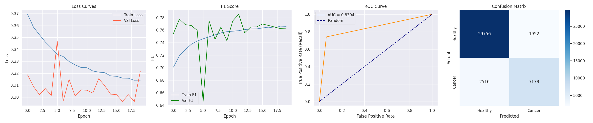
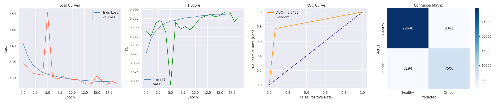

# breast-cancer-detection-cnn-and-resnet18
# 🩺 Breast Cancer Histopathology Image Classification using Deep Learning

An end-to-end Deep Learning project that classifies breast histopathology image patches as **IDC Positive** or **IDC Negative** using **CNN** and a **ResNet-18 implemented entirely from scratch in PyTorch**.

The project focuses on model development, experimentation, evaluation, and optimization while comparing a custom CNN against a deeper residual architecture.

---

# 📌 Project Summary

This project investigates the application of Deep Learning for breast cancer detection from histopathology images. Two architectures—a custom Convolutional Neural Network (CNN) and a ResNet-18 built entirely from scratch—were implemented and evaluated on the IDC Histopathology dataset.

The work emphasizes proper dataset splitting, preprocessing, augmentation, experimentation, and model evaluation using multiple performance metrics. The final ResNet-18 model achieved superior performance and was later deployed as a production-ready web application (available in a separate deployment repository).

---

# 🚀 Project Highlights

* ✅ CNN implemented entirely from scratch
* ✅ ResNet-18 implemented entirely from scratch (without `torchvision.models`)
* ✅ Patient-level train/validation/test split to prevent data leakage
* ✅ CLAHE preprocessing
* ✅ Albumentations data augmentation
* ✅ Weighted BCE loss for class imbalance
* ✅ Hyperparameter experimentation
* ✅ ROC-AUC: **0.94**
* ✅ F1 Score: **0.78**
* ✅ Reduced training time from **45 min → 6 min** by preloading images into RAM

---

# 📂 Dataset

**IDC Breast Histopathology Dataset**

Source:
https://www.kaggle.com/datasets/paultimothymooney/breast-histopathology-images

Dataset Statistics

* 277,524 RGB image patches
* Image Size: 50 × 50 pixels
* 279 patients
* Binary classification

Classes

* IDC Negative
* IDC Positive

---

# 🧠 Model Development

## CNN

A baseline Convolutional Neural Network was implemented from scratch to establish a performance benchmark.

Architecture includes:

* Convolution Layers
* Batch Normalization
* Max Pooling
* Dropout
* Fully Connected Layers
* BCEWithLogitsLoss

---

## ResNet-18

The complete ResNet-18 architecture was implemented from scratch in PyTorch without using the pretrained torchvision implementation.

Key architectural decisions:

* Custom BasicBlock implementation
* Residual Skip Connections
* 3×3 initial convolution instead of 7×7
* Removed initial MaxPooling layer to preserve fine histopathology features
* Batch Normalization
* Binary classification head

---

# 🛠 Image Preprocessing Pipeline

The following preprocessing pipeline was applied before training:

* CLAHE (Contrast Limited Adaptive Histogram Equalization)
* RGB normalization
* Albumentations data augmentation
* Image resizing
* Tensor conversion

To address dataset imbalance (~3:1 Healthy vs Cancer), weighted binary cross-entropy loss was used.

---

# 📈 Training Results

## CNN Results

<p align="center">

</p>

The baseline CNN achieved stable convergence while providing a benchmark for comparison with deeper architectures.

Evaluation includes:

* Training Loss
* Validation Loss
* F1 Score
* ROC Curve
* Confusion Matrix

---

## ResNet-18 Results

<p align="center">

</p>

The custom ResNet-18 demonstrated:

* Better feature learning
* Higher ROC-AUC
* Improved F1 Score
* Better generalization

compared to the baseline CNN.

---

# 📊 Performance Comparison

| Metric   | CNN  | ResNet-18 |
| -------- | ---- | --------- |
| F1 Score | 0.76 | **0.78**  |
| ROC-AUC  | 0.84 | **0.94**  |

---

# 🔬 Experiments

The following experiments were conducted during model development:

* CNN vs ResNet-18 comparison
* Learning rate tuning
* Dropout regularization
* Class imbalance handling using weighted loss
* CLAHE preprocessing
* Data augmentation strategies
* Patient-level dataset splitting
* Training time optimization through RAM preloading

---

# 📁 Repository Structure

```text
breast_cancer_classification/

│
├── notebooks/
│   └── breast_cancer_resnet.ipynb
│
├── models/
│   ├── cnn_best_model.pth
│   └── resnet18_best_model.pth
│
├── images/
│   ├── cnn_results_breast_cancer.png
│   └── resultsresnet18_results.png
│
└── README.md
```

---

# 📒 Notebook

The complete implementation is available in:

```text
notebooks/breast_cancer_resnet.ipynb
```

The notebook includes:

* Dataset loading
* Exploratory analysis
* Image preprocessing
* Data augmentation
* CNN implementation
* ResNet-18 implementation
* Training pipeline
* Validation pipeline
* Hyperparameter tuning
* Performance evaluation
* Learning curves
* ROC curves
* Confusion matrices

---

# 🔗 Deployment

The trained ResNet-18 model has been deployed as a production-ready web application using FastAPI, Docker, and Render.

➡️ Deployment Repository:
**https://github.com/varshi0905/breast_cancer_api**

➡️ Live Demo:
**https://breast-cancer-detection-61e3.onrender.com**

---

# 🛠 Tech Stack

### Deep Learning

* PyTorch
* NumPy
* OpenCV
* Albumentations
* Pillow
* Matplotlib
* Scikit-learn

### Development

* Python
* Jupyter Notebook

---

# 🚀 Future Work

* U-Net based segmentation
* Grad-CAM explainability
* Vision Transformer (ViT) comparison
* EfficientNet benchmarking
* Mixed precision training
* ONNX export

---

# 👩‍💻 Author

**Lasya Varshini Buddhavarapu**

GitHub: https://github.com/varshi0905
